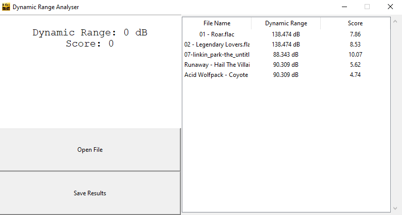

# Audio Dynamic Range Analyser

---
This program takes in an audio file, and calculates and returns a score based on its dynamic range.

Dynamic range calculation is done through the formula given here: https://en.wikipedia.org/wiki/Dynamic_range
### WHAT'S DONE:
- Dynamic range calculation
- Score calculation
- GUI
- File Opening
- PySQLite Database Persistence

### TODO:
- Waveform grapher to visualise dynamic range
- Score Sorting
___
## What is Dynamic Range? Why do we care about it?
In an audio file, dynamic range describes the difference in volume between the loudest parts of a track, and the quietest parts.

Tracks with good dynamic range have a very large difference between the loudest and quietest parts. 
When listening to music, a good difference in volume can make for a good listening experience.
Bigger difference in volume means different instruments may sound louder or quieter, adding depth and making things sound more impactful.

This is an extremely abridged explanation. For more information, I think this video describes dynamic range far better than I can.

https://www.youtube.com/watch?v=3Gmex_4hreQ
___
## The Program

Simply run ui_operations.py and you should be greeted with:

From there it should be fairly self-explanatory on how to use the program.
Clicking 'Open File' opens a window which lets you choose an audio file to load into the program. If the file is valid, it will immediately start calculating the dynamic range and score. If the file is invalid, it does nothing.

Clicking 'Save Results' saves the result of the calculations into the table on the right. Double-clicking on any of the items in that table will remove it.